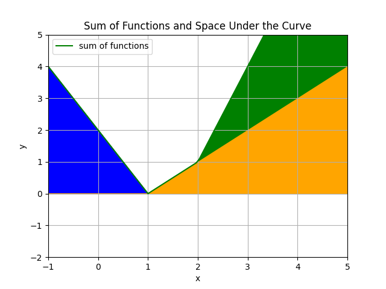

# **Machine Learning Overview**

## **Supervised Learning**
### **Description:**
The algorithm is trained on **labeled** dataset, where each **input** is associated with a **corresponding output**.
### **Goal:**
To **learn a mapping from inputs to outputs** so that algolritm can **make accurate predictions on unseen data**.

## **Unsupervised Learning**
### **Description:**
The algorithm is trained on **unlabeled** dataset
### **Goal:**
To find patterns, structures or relationships within the data **without** explicit guidance. 

## **Reinforcement Learning**
### **Description:**
An agent learns to make decision by interacting with the environment. It receives feedback in form of either reward or punishment based on actions it takes.
### **Goal:**
To learn a strategy that maximizes cumulative reward over time.

# **Types Of Algorithms**

## **Regression - Supervised learning**
Predicting a continuous output variable based on input data point features

- Linear Regression (univariate/multiple linear regression =/= multivariae linear regression)
- Polynomial Regression

## **Classification - Supervised learning**
Assigning **predefined** labels to input data points based on their features

- Logical Regression (Binary classification model)
- Decision Trees (Binary classification model)

## **Segmentation - Unsupervised learning**
Dividing input data points into meaningful and homogeneous segments based on certain criteria

- k-means
- Hierarchical Clustering
- DBSCAN (Density Based Spatial Clustering of Application with Noise)

# **Evaluation Of Algorithms**

## **Classification**

To evaluate the performance of a binary classification model a confusion matrix was introduced. It summarizes the results of the classification by comparing the predicted and actual class labels counts.

| Actual - Predicted | Positive (1) | Negative (0) |
|-------------------|--------------|--------------|
| Positive (1)      | TP           | FN           |
| Negative (0)      | FP           | TN           |

- **True Positive (TP)**: The number of instances correctly predicted as positive (spam).
- **True Negative (TN)**: The number of instances correctly predicted as negative (not spam).
- **False Positive (FP)**: The number of instances incorrectly predicted as positive (spam).
- **False Negative (FN)**: The number of instances incorrectly predicted as negative (not spam).

Four more meaningful metrics can be derived from the table above:

### **Accuracy**: 

Overall correctness of the classification model. It is the ratio of correctly predicted instances (both true positives and true negatives) to the total number of instances.

$Accuracy = \dfrac{TP+TN}{TP+TN+FP+FN} $

**Usefulness:** Accuracy is useful when the classes are balanced, meaning there is an approximately equal number of instances for each class.

### **Precision**: 
Accuracy of positive predictions. It is the ratio of correctly predicted positive instances (true positives) to the total predicted positive instances (true positives and false positives)

$Precision = \dfrac{TP}{TP+FP} $

**Usefulness:** Precision is useful when the cost of false positives is high, and you want to ensure that the positive predictions are highly accurate.

### **Recall**: 

 Ability of the model to capture all the positive instances. It is the ratio of correctly predicted positive instances (true positives) to the total actual positive instances (true positives and false negatives).

$Recall = \dfrac{TP}{TP+FN} $

**Usefulness:** Recall is useful when the cost of false negatives is high, and you want to ensure that the model identifies a large portion of the actual positive instances.

## **Regression**
### **Root Mean Squared Error (RMSE):** 

$RMSE= \sqrt{\frac{1}{n} \sum_{i=1}^{n} (y_i - \hat{y}_i)^2}$

​RMSE is the square root of the average of the squared differences between the actual (yiyi​) and predicted (y^iy^​i​) values. It penalizes larger errors more significantly, making it sensitive to outliers.

# **Overfitting and Underfitting**

## **Overfitting**
Overfitting occurs when model learns the training data to well and start to capture noise and outliers, rather than actual patterns. As a result, it performs very well on training data, but fails to generalize to unseen data.

### **Causes**: 
- Too many features
    - not all features are relevant to the problem.
- Too complex model
    - using high order polynomials to fit simple data
- Insuficient data
    - if there is not enough data to detect pattern, model might start to capture noise.
    
### **Effects**: 
Overfit models often achieve low error on the training data but have higher error on new, unseen data, indicating poor generalization. It just simply learnt the training data as is, rather than extracting any meaningful pattern.

### **Prevention:**
- Cross-Validation: 
   - Use techniques like cross-validation to assess how well the model generalizes to new data.
- Regularization: 
    - Apply regularization techniques (e.g., L1 or L2 regularization) to penalize overly complex models.
- Feature Selection: 
   - Choose relevant features and avoid including irrelevant or redundant ones.
- More Data: 
   - Increasing the size of the training dataset can help the model generalize better.
- Simpler Models: 
   - Choose simpler models with fewer parameters to avoid overfitting 

## **Underfitting**
 Unlike overfitting, which involves a model that is too complex and learns training data too well, underfitting results in a model that is too simple to capture the relationships present in the data. As a result, an underfit model performs poorly on both the training data and new, unseen data.

### **Causes:**

- Too few features: 
    - If important features are omitted from the model, it may struggle to capture the complexity of the relationships.
- Too simple model: 
    - Using a model that is too simple to represent the underlying patterns in the data can lead to underfitting.
- Insuficient data
    - With too few examples to generalize from, the model might make simplistic assumptions that fail to capture the true complexity of the data

### **Effects**: 
An underfit model has high training error, indicating that it struggles to fit the training data well, and at the same time it performs poorly on new, unseen data, leading to high test error.

### **Prevention:**
- Feature Engineering: 
    - Ensure that relevant features are included in the model, and consider creating new features that might improve representation.
- More Data: 
   - Increasing the size of the training dataset can help the model generalize better.
- Increase Model Complexity: 
    - Use more complex models with additional parameters to increase the model's capacity to capture patterns.

# **Cross-validation**

The primary goal of cross-validation is to obtain a more accurate estimate of a model's performance, especially when the dataset is limited. When we split the datapoints into training and test data, the split may influence the models performance. To mitigate that we can utilize cross-validation:

## **K-Fold Cross-Validation**
1. Data is divided into K equally sized folds
2. The model is trained K times, each time using different K-1 folds for training, and different 1 fold for validation
3. Performance metrics are averaged over all K iterations to obtain more precise estimate.

# **Feature engineering**

## **Feature Scaling**
Bringing all the features to similar range, which may be important when using algorithms sensitive to magnitude of input features. It prevents certain features from taking over others. (Should also be performed when the argument range is too small copared to size of features)
- Normalization
- Standarization

## **Feature Selection**
Identifying and selecting a subset of input variables that are most relevant to the target variable.

## **Feature Reduction**
Reduce the number of features by extracting important information. 

## **Feature Generating**
This may refer to two things:
- generating missing values based on records that don't miss them
- generating new features using others (ie sum, multiplication, power: polynomial features)

# **Supervised Learning**

Supervised learning is using examples of input-output pairs to create a model that will as precisely as possible predict output for unseen inputs. To understand how this process works, we need to introduce several terms:

### **Training Example:** 
Single example input-output pair used to train the model. 

A single training example consists of $m$ input variables $x_1,x_2,...,x_m$ and coresponding output variable $y$. It is common to treat input variables as a vector:

$$(x_1,x_2,...,x_m,y) = (\vec{x},y) $$

to differentiate between multiple training examples in training set, we can introduce an indexing of training examples, where i-th trainign example is denoted with:

$$ (x_1^{(i)},x_2^{(i)},...,x_m^{(i)},y^{(i)}) = (\vec{x}^{(i)},y^{(i)})$$

### **Training Set $T$:** 
A collection of example input-output pairs used to train the model. 

Set of all $n$ training examples is called a training set:

$$T = \{ (x_1^{(i)},x_2^{(i)},...,x_m^{(i)},y^{(i)}):i = 1,..n \} =\{(\vec{x}^{(i)},y^{(i)}):i = 1,..n \} $$

To denote training set, we can use a matrix notation:

$$ 
T = [ X | Y ] = 

\left[
\begin{array}{c|c}
\vec{x}^{(1)} & y^{(1)} \\
\vec{x}^{(2)} & y^{(2)} \\
\vec{x}^{(3)} & y^{(3)} \\
.  & .\\
.  & . \\
\vec{x}^{(n)} & y^{(n)} 
\end{array}
\right]

=

\left[
\begin{array}{ccccc|c}
x_1^{(1)} & x_2^{(1)} & x_3^{(1)} & . & x_m^{(1)} & y^{(1)} \\
x_1^{(2)} & x_2^{(2)} & x_3^{(2)} & . & x_m^{(2)} & y^{(2)} \\
x_1^{(3)} & x_2^{(3)} & x_3^{(3)} & . & x_m^{(3)} & y^{(3)} \\
. & . & . & .  & . & .\\
. & . & . & .  & . & . \\
x_1^{(n)} & x_2^{(n)} & x_3^{(n)} & . & x_m^{(n)} & y^{(n)} 
\end{array}
\right]
$$

### **Test Set:** 
A separate collection of example input-output pairs that are not seen by the model during training. The test set is used to evaluate the performance of the trained model on unseen data.

### **Model $f_P$:** 
Model is a function $f_P:\mathbb{R}^n \rightarrow \mathbb{R}$ **parametrized** by parameters $P$, which takes as an argument a vector of input variables and returns a single output variable. 

$$f_P(\vec{x}) = y$$

### **Loss Function $L$:** 
Loss function quantifies the difference between the predicted output and the true output for a single training example. It measures how well the model performs on individual example.

$$L(f_P,(\vec{x},y)) \in \mathbb{R}$$

### **Cost Function $J$:** 
The cost function aggregates the losses over the entire training set. It represents the overall error of the model across all training examples and serves as the objective function to be minimized during training

Cost of error $J$ is a function that takes parametrized function $f_P$, training set $T$ and loss function $L$ and determines the cost of error for model $f_P$ over the training set $T$. 

For example:

$$J(f_P,T,L) = \frac{1}{n} \sum_{i=1}^{n} L(f_P,(\vec{x}^{(i)},y^{(i)})) \in \mathbb{R}$$

### **Training:** 

The process of adjusting the model's parameters $P$ to minimize the cost of prediction error $J$ over Training Set $T$ is called training. In other words, it is minimizing the cost function $J(f_P,T, L)$ over the set $T$ by adjusting **only** the parameters $P$. 

The algorithm most commonly used to minimize cost function is called Gradient Descent.

# **Supervised Learning example: Linear Regression**
Using supervised learning to predict continous output variable using input variables is a regression problem. The simplest model that can aid us in solving this problem is Linear Regression model.

### **Linear Regression Model $f_P$:** 

Linear regression model $f_P$ is parametrized with parameters $P = (\vec{w},b)$ and defined as dot product of input vector $\vec{x}$ and weight vector $\vec{w}$, added to bias $b$:

$$
f_P(\vec{x}) = f_{\vec{w},b}(\vec{x}) = \vec{w} \cdot \vec{x} + b
$$

### **Linear Regression Loss Function $L$:** 

Loss function used with Linear Regression is most commonly a Squared Error function. To calculate Squared Error for function $f_P$ parametrized with parameters $P$ and a single example $(\vec{x},y)$

$$L(f_{\vec{w},b},(\vec{x},y)) = (f_{\vec{w},b}(\vec{x})-y)^2$$

which in case of Linear regression looks like this:

$$
f_P(\vec{x}) = \vec{w} \cdot \vec{x} + b
$$

Generally speaking:

- SE is sensitive to outliers 
   - Squared error favours distributing error between multiple examples, rather than one, so any extreme outlier can skew the approximation because the model will prefer to share the error between multiple points, rather than keep the error in one outlier.
- SE is convex
   - this results in a single global minimum and Cost Function shape that makes gradient descent very efective. So we are going to quickly converge to a global minimum. 

### **Linear Regression Cost Function $J$:** 

For example, we can use Squared Error cost function:

$$ J(f_{\vec{w},b}, T) = \frac{1}{2n}  \sum_{i=1}^{n}(f_{\vec{w},b}(\vec{x}^{(i)})-y^{(i)})^2 $$

It's just an average of Lost Function values over whole training set, but divided by two. The two in $\frac{1}{2n}$ is just added so that when calculating the derivative of Cost Function we will have constant $2$ cancel out. Note that actual value of Cost doesn't matter, what matter is the nature of it's change over the examples (quadratic, linear, log, etc). We can multiply it by whatever constant to accomodate further calculations.

Cost and Loss functions are dependent on out model application and stucture. Often times we choose them to match out activation functions, since they will interact when calculating gradient descent.

# **Supervised Learning example: Logistic Regression**
Using supervised learning to predict **discrete** output variable using input variables is a classification problem. The simplest model that can aid us in solving this problem is Logistic Regression model.

Logistic regression is an example of binary classification, that is classification than predicts chances of two opposing outcomes. Given vector of features $\vec{x}$ we predict value $y\in \{0,1\}$.  

Logistic regression model itself predicts **the probability** that given input belongs to one of two categories. We take that probability and apply a **decision boundary** to decide how these probabilities translate to actual classification outcomes.

### **Logistic Regression Model $f_P$:** 

Logistic regression model $f_P$ is parametrized with parameters $P = (\vec{w},b)$ and defined as dot product of input vector $\vec{x}$ and weight vector $\vec{w}$, added to bias $b$, and then put throught sigmoid function, in order to map the output from $\mathbb{R}$ to probability space $(0,1)$

$$
f_{\vec{w},b}(\vec{x}) = \frac{1}{1+e^{\vec{w} \cdot \vec{x} + b}}
$$

As we mentioned above, the outcome is a probability that vector $\vec{x}$ belongs to class $y = 1$, given model parameters $\vec{w},b$:

$$
f_{\vec{w},b}(\vec{x}) = P(y=1|\vec{x}; \vec{w}, b)
$$

### **Decision bounary:** 

We mentioned **decision boundary** as a tool for translating probability of outcome to actual outcome. Decision boundary is a hyperspace that separates input space into regions associated with each probability classes. It represents a point at which logistic regression predicts probability of $0.5$ for each class:

examples of decision boundaries for different models:

# **Activation functions**

## **Why do we need activation functions in Neural Networks?**

From linear algebra we know that a combination of linear transformations is also a linear transformation. From highschool we know that if $h(x)$ and $g(x)$ are linear, then $h(g(x))$ is linear as well. Without activation functions, the neural network would effectively be a linear combination of its inputs and weights. This means that no matter how many layers or neurons are added, the overall relationship that the network can model would still be linear. Activation functions introduce nonlinearities to the network's output, allowing it to model complex and nonlinear relationships in the data.

## **Examples of activation functions**
### **Linear activation function**
Also known as "no activation function" is just and identity function $\mathbb{R} \rightarrow \mathbb{R}$

$$g(z) = z$$

### **Sigmoid**
Function mapping $\mathbb{R} \rightarrow [0,1]$

$$g(z) = \frac{1}{1+e^{-z}}$$

### **ReLU**
Also known as Rectified Linear Unit, is a function mapping $\mathbb{R} \rightarrow [0,\infty]$

$$g(z) = max(0,z)$$

### **Softmax**
Function mapping $\mathbb{R^n} \rightarrow [0,1]^n$ where $n \geq 1$

$$g(\vec{z}) = (\frac{e^{z_1}}{e^{z_1} + e^{z_2}, + ... + e^{z_n}}, \frac{e^{z_2}}{e^{z_1} + e^{z_2}, + ... + e^{z_n}}, ... , \frac{e^{z_n}}{e^{z_1} + e^{z_2}, + ... + e^{z_n}})$$

The softmax function takes as input a vector $\vec{z} = (z_1,z_2,...,z_n)$ of $n$ real numbers, and normalizes it into a probability distribution consisting of $n$ probabilities proportional to the exponentials of the input vector features. This is usef for classifcation tasks, in both linear regression variation called 

Noticably, $exp$ function is costly to calculate on a computer and prone to suffer from numerical overflow. Why use it then? It seems any other positive, differentiable, monotonic function should be just as good. The main reason is softmax's compatibility with Cross-Entropy loss function. More [in this video](https://www.youtube.com/watch?v=p-6wUOXaVqs).

TODO Also note, that when training a NN for classification, we don't use Softmax, rather, a Linear activation, because linear is more numerically stable. Once trained and we want to make predictios, we can switch the ouput layer activation function to softmax. 

TODO Checkout multiclass Lab in Multiclass Classification Week 2

## **Choosing activation function**
You can choose different activation functions for different neurons in NN.

### **Input layer** 
Is not calculated.

### **Output layer** 
Output layer activation functions should match the range of values we are trying to predict:

- **Binary classification**
   When working on a binary classification problem, use sigmoid as output layer activation function, because then the NN will learn to predict the probability of y being 1.

- **Regression (positive and negative values)**
Stock market change can be eiter positive or negative and theoretically unbounded. This is when we would use linear activation fucntion because the values we are trying to model.

- **Regression (positive values only)**
Conversly, when trying to predict house value which can only be positive, we would use ReLu

### **Hidden layers** 
Most NN nowadays use ReLU in hidden layers for two reasons: It's faster than sigmoid, and most importantly, because of the fact that sigmoid goes flat to the left and right of 0 (compared to ReLU which is flat only on the left of 0), gradient descent is much faster for ReLU. This is because flat activation function flattens the cost function $J$ which in turn slows down gradient descent. 
(TODO "Why is ReLU activation function prefered for hidden layers rather than sigmoid?" and read about Sparse Activation, Vanishing Gradient Problem and Saturation)

## **Activation functions in action - ReLU vs Linear**

### **Problem description**
To demonstrate the characteristics of different activation functions, lets image a scenario: we are trying to approximate one variable function $y = h(x)$ using a neural network. Since we are mapping one input variable $x$ to one output variable $y$, our network will have one input and one output neurons. For this particular example lets make it have one hidden layer with three neurons, looking like so:

Plot of the function $h$ we are trying to approximate looks like this:

### **Solution using linear activation function**

As mentioned before, no matter how many layers and weight we'll use, the result will always be linear. Since the function we want to map is non linear, this approximation is useless. A complex model such as neural network is not going to yield satysfing results unless we adress the linearity problem.

### **Solution using ReLU activation function**

You might be asking yourself - since linear functions d on't help us model non-linear dependencies, how can we expect ReLU to do it? The trick is in ReLUs ability to activate only if its argument is above certain threshold. In other words, we can use linear dependencies to model non linear dependecies by approximating them with lines only for certain intervals. **HERE** Interesting property to observe is that each neuron of our hidden layer allows for one additional interval with line in our approximation. Since $h$ consists of three connected linear functions, we will be able to approximate it 1:1 using hidden layer with three neurons.

Let's assume we used ReLU and trained the network, fixing output weight equal to $1$ and output bias equal to $0$. We might have ended up with these:

Lets explain what we're seeing here. This is a plot of functions consisting the hidden layer, which look like so on their own:

each line represents one linear function from hidden layers

Let's plot them processed with ReLU:

Lets plot a sum of them, 

$$y = ReLU(-2x+2) + ReLU(x-1) +ReLU(2x-4)$$

colouring space under the plot to represent how much each function contributed to sum:

## **Adam algorithm**

Adjusts learning rate $\alpha$ automaticialty as needed (increases or decreases)

Different learning rates for all parameters w1, w2.. 

Intuintion: 
- if wj or b keeps moving in the same direction, increase $\alpha_j$
- if wj or b keeps oscillationg, reduce $\alpha_j$

## **NN Layer types**

### **Dense**
So far we only used 'Dense' layers. In Dense layers each neuron output is a function of all the outputs from the previous layer.

### **Convolutional**

why use them:
    - faster computation
    - less training data required (less prone to overfitting)

